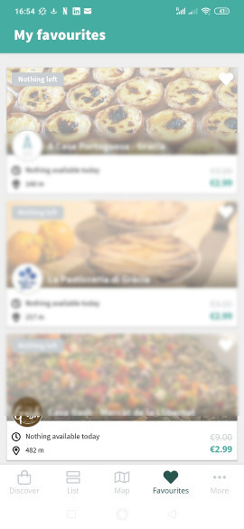
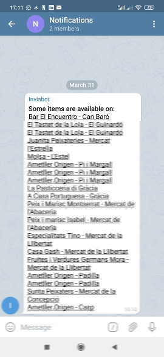
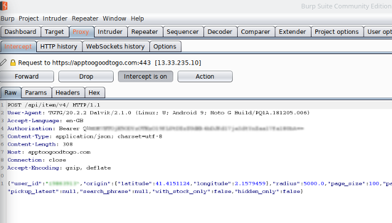

# TG2G Notifier

## Background

Basically, I was tired of constantly refreshing my "Favorites" tab, on the app, to see if anything interesting became available. In more popular shops, sometimes items were getting sold out in a matter of minutes, so it was really **critical** to get notified, in order to get hold of my favorite items!

 

## Description

This is a server application and a TG2G client. Every minute, it checks if any of your favorite items has become available. If they are available, it send a message to a telegram channel.

 

The application checks for changes, so if nothing changes from the previous request (e.g.: no items became available or unavailable) it does not send any message. In this way, we prevent flooding the telegram channel with messages.

Not sure if TG2G checks for the latency of requests for a given IP. Just to be safe, I would not be *always* running the server application, but would use it during a given time, when I know interesting items will became available (for instance, between 21h and 22h). You can check the favorite section to see when the items were last sold out. Most shops have pretty consistent time patterns.


## INSTALL & RUN

Install with Node 8x:

```bash
npm install
```

Run with:

```bash
npm start
```

If you don't have node installed, you can run this service with [docker](https://www.docker.com/):

```bash
docker-compose up -d
```

This will build the image, locally, and start the container. You can attach to its output with:

```bash
docker logs --follow tg2g
```

The server will run on port 3000, and it produces some verbose output in JSON, so you can track down possible issues.

```JSON
Tg2g Notifier listening on port 3000!
Tg2g Notifier listening on port 3000!
{ "timestamp": "Tue, 31 Mar 2020 15:30:01 GMT", "status": "OK", "items": 3}
{ "timestamp": "Tue, 31 Mar 2020 15:31:01 GMT", "status": "OK", "items": 1}
{ "timestamp": "Tue, 31 Mar 2020 15:31:01 GMT", "status": "OK", "items": 0}
{ "timestamp": "Tue, 31 Mar 2020 15:32:01 GMT", "status": "OK", "items": 0}
{ "timestamp": "Tue, 31 Mar 2020 15:32:01 GMT", "status": "OK", "items": 0}
```

## SETUP

This application needs some setup in order to run.
You need to create a .env file, with the following content:

```bash
TGTG_USER_ID=[YOUR USER ID]
TGTG_USER_TOKEN=[YOUR USER TOKEN]
TELEGRAM_API_TOKEN=[YOUR TELEGRAM API TOKEN]
```

To understand how to fill these values, please read bellow.

### TG2G credentials

In order to connect retrieve your TGT user id and token, you will need to sniff the requests on your phone app.
To do that, you can use the [PortSwigger proxy](https://portswigger.net/). The free version works fine for this task.
Follow this tutorial, to understand how to setup the proxy:

https://portswigger.net/support/configuring-an-android-device-to-work-with-burp.

You should go through the following steps:
* Install and configure PortSwigger on your computer.
* Configure your phone to use the proxy.
* On your phone, enter the proxy page to download the SSL certificate. Install that certificate on your phone.
* The certificate will be installed as a user certificate, but in order for TG2G it needs to be a system certificate. In order to do that, you need to copy the certificate file to `/system/etc/security/cacerts/`. Use [adb](https://www.fosslinux.com/25170/how-to-install-and-setup-adb-tools-on-linux.htm) to do that (you will need to root your phone first!)
* If the app refuses to use the proxy, install [ProxyDroid](https://play.google.com/store/apps/details?id=org.proxydroid&hl=en) on your phone.
* Open the TG2G app, and refresh the favourites tab. The intercepted requests should popup on your PortSwigger dashboard (Proxy-> Intercept)

Bellow you can see how an intercepted request looks like. Take note of the `Bearer` (TGTG_USER_TOKEN) and `user_id`_ (TGTG_USER_ID). Update them in your .env file.

 

### Telegram

todo

## Contributing

### Developing

New functionalities are welcome. To begin developing:

```
git clone 
git checkout -b my-dev-branch
```

Where you should give your branch a more descriptive name than "my-dev-branch".

Once you've made your changes (and tested them), please create a pull request.

### Issues

Please use the [issue tracker](https://github.com/doublebyte1/tg2_notifier/issues) on GitHub.

### Donations

If you want to support this project, by helping the developers to buy some coffee, use this bitcoin wallet:

[19vwDaR8MAh28BAbVmqtVj3pW35oxsq7yV](https://www.blockchain.com/btc/payment_request?address=19vwDaR8MAh28BAbVmqtVj3pW35oxsq7yV)


## Contributors:
 * [Joana Simoes](http://github.com/doublebyte1)

## License:
 * [GPL](LICENSE)